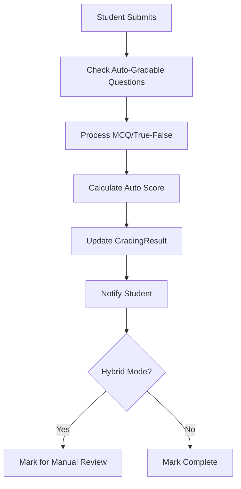
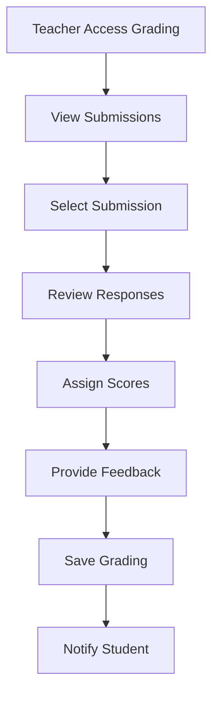
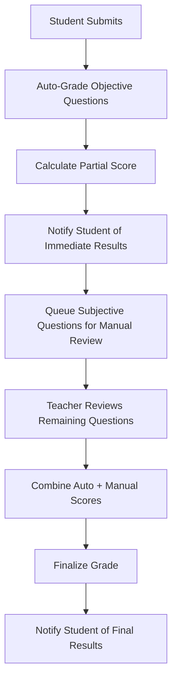

# Enhanced Grading System Documentation

## Overview

The Enhanced Grading System provides a comprehensive solution for both automatic and manual grading of assignments and quizzes in the Thutothebe Learning Management System. This system supports real-time feedback, hybrid grading workflows, and unified grading interfaces for both teachers and students.

## Table of Contents

1. [System Architecture](#system-architecture)
2. [Core Components](#core-components)
3. [Grading Workflows](#grading-workflows)
4. [Entity Relationships](#entity-relationships)
5. [API Endpoints](#api-endpoints)
6. [Configuration](#configuration)
7. [Usage Examples](#usage-examples)
8. [Best Practices](#best-practices)
9. [Troubleshooting](#troubleshooting)

## System Architecture

### Design Principles

The Enhanced Grading System follows SOLID principles and implements:

- **Single Responsibility**: Each component has a specific grading-related function
- **Open/Closed**: Extensible for new question types and grading algorithms
- **Liskov Substitution**: Gradable interface allows polymorphic grading
- **Interface Segregation**: Focused interfaces for specific grading operations
- **Dependency Inversion**: Service abstractions enable flexible implementations

### Architectural Patterns

- **Strategy Pattern**: Different grading strategies for various question types
- **Template Method**: Common grading workflow with customizable steps
- **Observer Pattern**: Real-time grading notifications
- **Factory Pattern**: Question type-specific grading handlers

## Core Components

### 1. Gradable Interface

```java
public interface Gradable {
    Long getId();
    String getTitle();
    GradingType getGradingType();
    GradingMode getGradingMode();
    Integer getMaxScore();
    boolean canAutoGrade();
}
```

**Purpose**: Unified interface for all gradable entities (Assignments, Quizzes)

**Key Methods**:
- `canAutoGrade()`: Determines if automatic grading is possible
- `getGradingType()`: Returns the grading approach (AUTO, MANUAL, HYBRID)
- `getGradingMode()`: Returns the grading execution mode

### 2. Grading Enums

#### GradingType
- `AUTO`: Fully automatic grading
- `MANUAL`: Teacher-only grading
- `HYBRID`: Combination of automatic and manual grading

#### GradingMode
- `AUTO_ONLY`: Only automatic grading allowed
- `MANUAL_ONLY`: Only manual grading allowed
- `HYBRID`: Both automatic and manual grading supported

#### GradingStatus
- `PENDING`: Awaiting grading
- `AUTO_COMPLETE`: Automatic grading finished
- `PENDING_MANUAL`: Awaiting manual review
- `MANUAL_COMPLETE`: Manual grading finished
- `COMPLETE`: All grading finished
- `REQUIRES_REVIEW`: Needs instructor attention

### 3. Core Entities

#### GradingResult
Central entity tracking grading outcomes:

```java
@Entity
public class GradingResult extends BaseEntity {
    private Long submissionId;
    private Long graderId;
    private Integer autoScore;
    private Integer manualScore;
    private Integer finalScore;
    private GradingStatus status;
    private String feedback;
    private LocalDateTime gradedAt;
    private LocalDateTime autoGradedAt;
    private LocalDateTime manualGradedAt;
}
```

#### AssignmentQuestion
Enables auto-gradable questions within assignments:

```java
@Entity
public class AssignmentQuestion extends BaseEntity {
    private Long assignmentId;
    private String questionText;
    private QuestionType questionType;
    private String correctAnswer;
    private Integer points;
    private Integer orderIndex;
    private boolean autoGradable;
}
```

#### AssignmentResponse
Student responses to assignment questions:

```java
@Entity
public class AssignmentResponse extends BaseEntity {
    private Long submissionId;
    private Long questionId;
    private String responseText;
    private Integer scoreAwarded;
    private boolean autoGraded;
    private String feedback;
}
```

## Grading Workflows

### 1. Automatic Grading Workflow



**Supported Question Types**:
- Multiple Choice Questions (MCQ)
- True/False Questions
- Short Answer (exact match)
- Numerical Answers

### 2. Manual Grading Workflow



### 3. Hybrid Grading Workflow



## Entity Relationships

### Enhanced Entity Relationship Diagram

```
Course
├── Assignment (implements Gradable)
│   ├── AssignmentQuestion
│   │   └── AssignmentQuestionOption
│   └── Submission
│       ├── AssignmentResponse
│       └── GradingResult
├── Quiz (implements Gradable)
│   ├── Question
│   │   └── QuestionOption
│   └── QuizSubmission
└── Module
```

### Key Relationships

1. **Course → Assignment/Quiz**: One-to-many relationship
2. **Assignment → AssignmentQuestion**: One-to-many for auto-gradable content
3. **Submission → GradingResult**: One-to-one grading tracking
4. **Submission → AssignmentResponse**: One-to-many for question responses
5. **GradingResult → User (Grader)**: Many-to-one for teacher tracking

## API Endpoints

### Grading Service Endpoints

#### Auto-Grade Submission
```http
POST /api/grading/auto-grade/{submissionId}
```

**Response**:
```json
{
  "status": "success",
  "message": "Auto-grading completed",
  "data": {
    "gradingResultId": 123,
    "autoScore": 85,
    "maxScore": 100,
    "status": "AUTO_COMPLETE",
    "gradedAt": "2024-01-15T10:30:00"
  }
}
```

#### Manual Grade Submission
```http
POST /api/grading/manual-grade/{submissionId}
```

**Request Body**:
```json
{
  "graderId": 456,
  "manualScore": 90,
  "feedback": "Excellent work on the essay portion",
  "questionScores": [
    {
      "questionId": 789,
      "score": 8,
      "feedback": "Good analysis"
    }
  ]
}
```

#### Finalize Grade
```http
POST /api/grading/finalize/{submissionId}
```

#### Get Grading Results
```http
GET /api/grading/results/{submissionId}
```

#### Re-grade Submission
```http
POST /api/grading/re-grade/{submissionId}
```

### Assignment Question Management

#### Create Assignment Question
```http
POST /api/assignments/{assignmentId}/questions
```

**Request Body**:
```json
{
  "questionText": "What is the capital of France?",
  "questionType": "MCQ",
  "correctAnswer": "Paris",
  "points": 10,
  "autoGradable": true,
  "options": [
    {"optionText": "London", "isCorrect": false},
    {"optionText": "Paris", "isCorrect": true},
    {"optionText": "Berlin", "isCorrect": false}
  ]
}
```

## Configuration

### Application Properties

```properties
# Grading Configuration
grading.auto.enabled=true
grading.real-time.enabled=true
grading.hybrid.default-mode=true
grading.notification.enabled=true

# Auto-grading Thresholds
grading.auto.mcq.threshold=0.8
grading.auto.short-answer.similarity=0.9
grading.auto.numerical.tolerance=0.01

# Performance Settings
grading.batch.size=50
grading.timeout.seconds=30
```

### Grading Rules Configuration

```java
@Configuration
public class GradingConfiguration {
    
    @Bean
    public GradingRules defaultGradingRules() {
        return GradingRules.builder()
            .mcqPartialCredit(false)
            .shortAnswerCaseSensitive(false)
            .numericalTolerance(0.01)
            .autoGradeTimeout(Duration.ofSeconds(30))
            .build();
    }
}
```

## Usage Examples

### 1. Creating an Auto-Gradable Assignment

```java
// Create assignment with mixed question types
Assignment assignment = new Assignment();
assignment.setTitle("Java Fundamentals Quiz");
assignment.setGradingType(GradingType.HYBRID);
assignment.setGradingMode(GradingMode.HYBRID);
assignment.setMaxScore(100);

// Add auto-gradable MCQ
AssignmentQuestion mcqQuestion = new AssignmentQuestion();
mcqQuestion.setQuestionText("Which keyword is used to create a class in Java?");
mcqQuestion.setQuestionType(QuestionType.MCQ);
mcqQuestion.setCorrectAnswer("class");
mcqQuestion.setPoints(10);
mcqQuestion.setAutoGradable(true);

// Add manual essay question
AssignmentQuestion essayQuestion = new AssignmentQuestion();
essayQuestion.setQuestionText("Explain the concept of inheritance in OOP");
essayQuestion.setQuestionType(QuestionType.ESSAY);
essayQuestion.setPoints(20);
essayQuestion.setAutoGradable(false);
```

### 2. Processing Student Submission

```java
// Student submits assignment
Submission submission = submissionService.createSubmission(assignmentId, studentId);

// Add responses
AssignmentResponse mcqResponse = new AssignmentResponse();
mcqResponse.setSubmissionId(submission.getId());
mcqResponse.setQuestionId(mcqQuestion.getId());
mcqResponse.setResponseText("class");

// Trigger grading
GradingResultDTO result = gradingService.processSubmission(submission.getId());

// Check if auto-grading completed
if (result.getStatus() == GradingStatus.AUTO_COMPLETE) {
    // Notify student of immediate results
    notificationService.notifyAutoGradingComplete(studentId, result);
}
```

### 3. Teacher Manual Grading

```java
// Teacher reviews pending submissions
List<GradingResultDTO> pendingGrades = gradingService
    .findByStatusAndGrader(GradingStatus.PENDING_MANUAL, teacherId);

// Grade essay question
ManualGradingRequest request = new ManualGradingRequest();
request.setGraderId(teacherId);
request.setManualScore(18);
request.setFeedback("Good explanation, but could elaborate more on polymorphism");

GradingResultDTO finalResult = gradingService.manualGrade(submissionId, request);

// Finalize the grade
gradingService.finalizeGrade(submissionId);
```

## Best Practices

### 1. Question Design

**Auto-Gradable Questions**:
- Use clear, unambiguous language
- Provide comprehensive answer options for MCQ
- Set appropriate point values
- Test questions before deployment

**Manual Questions**:
- Provide clear rubrics
- Set realistic time expectations
- Include example responses
- Use consistent grading criteria

### 2. Grading Workflow

**For Teachers**:
- Review auto-graded results before finalizing
- Provide constructive feedback
- Use consistent grading standards
- Grade promptly to maintain student engagement

**For System Administrators**:
- Monitor auto-grading accuracy
- Adjust grading rules based on feedback
- Ensure system performance during peak times
- Backup grading data regularly

### 3. Performance Optimization

- Use batch processing for large submissions
- Implement caching for frequently accessed data
- Monitor database query performance
- Use asynchronous processing for time-intensive operations

## Troubleshooting

### Common Issues

#### 1. Auto-Grading Failures

**Symptoms**: Auto-grading status remains PENDING
**Causes**:
- Invalid question configuration
- Missing correct answers
- System timeout

**Solutions**:
```java
// Check question configuration
boolean canAutoGrade = assignmentService.canAutoGrade(assignmentId);

// Verify correct answers are set
List<AssignmentQuestion> invalidQuestions = assignmentQuestionService
    .findAutoGradableWithoutCorrectAnswers(assignmentId);

// Retry auto-grading
gradingService.retryAutoGrading(submissionId);
```

#### 2. Score Calculation Errors

**Symptoms**: Incorrect final scores
**Causes**:
- Rounding errors
- Missing question scores
- Incorrect weight calculations

**Solutions**:
```java
// Recalculate scores
gradingService.recalculateScore(submissionId);

// Audit score calculation
ScoreAuditDTO audit = gradingService.auditScore(submissionId);
```

#### 3. Performance Issues

**Symptoms**: Slow grading response times
**Causes**:
- Large submission batches
- Complex question types
- Database performance

**Solutions**:
- Enable batch processing
- Optimize database queries
- Use caching strategies
- Implement async processing

### Monitoring and Logging

```java
// Enable grading metrics
@Component
public class GradingMetrics {
    
    @EventListener
    public void onAutoGradingComplete(AutoGradingCompleteEvent event) {
        meterRegistry.counter("grading.auto.completed").increment();
        meterRegistry.timer("grading.auto.duration")
            .record(event.getDuration());
    }
    
    @EventListener
    public void onManualGradingComplete(ManualGradingCompleteEvent event) {
        meterRegistry.counter("grading.manual.completed").increment();
    }
}
```

### Error Handling

```java
@ExceptionHandler(GradingException.class)
public ResponseEntity<OhmaApiResponse<?>> handleGradingException(GradingException ex) {
    logger.error("Grading error: {}", ex.getMessage(), ex);
    return GlobalExceptionHandler.errorResponseEntity(
        "Grading failed: " + ex.getMessage(), 
        HttpStatus.INTERNAL_SERVER_ERROR
    );
}
```

## Future Enhancements

### Planned Features

1. **AI-Powered Grading**: Machine learning for essay evaluation
2. **Plagiarism Detection**: Integration with plagiarism checking services
3. **Advanced Analytics**: Detailed grading insights and reports
4. **Mobile Grading**: Native mobile app for teacher grading
5. **Peer Review**: Student peer grading capabilities
6. **Video/Audio Responses**: Support for multimedia submissions

### Extensibility Points

- Custom question type plugins
- Third-party grading service integration
- Advanced rubric systems
- Multi-language support
- Accessibility enhancements

---

## Support

For technical support or questions about the Enhanced Grading System:

- **Documentation**: Check this guide and API documentation
- **Issue Tracking**: Submit issues through the project repository
- **Community**: Join the developer community discussions
- **Training**: Access video tutorials and training materials

---

*Last Updated: January 2024*
*Version: 1.0.0* 